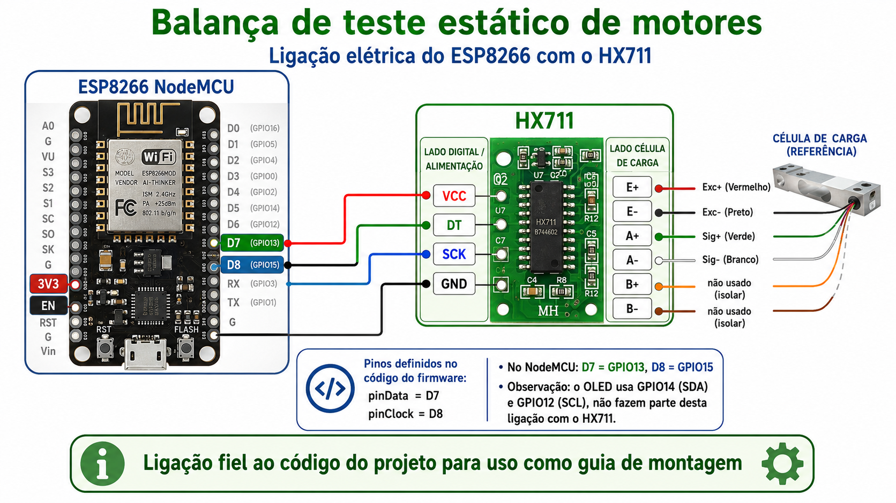
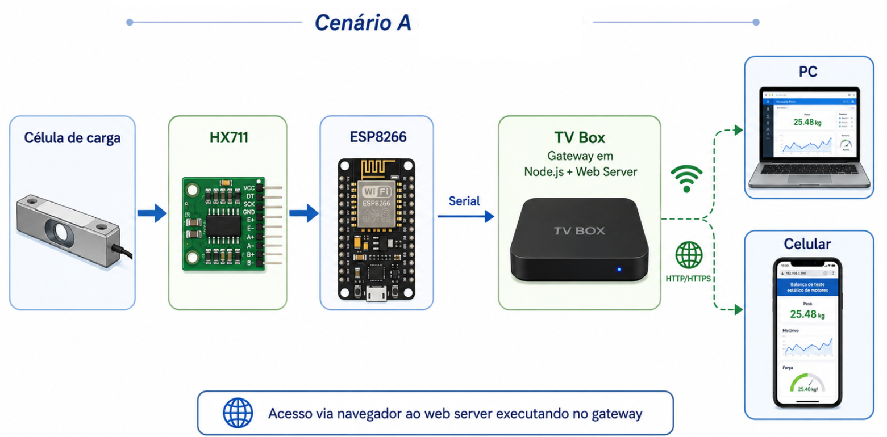
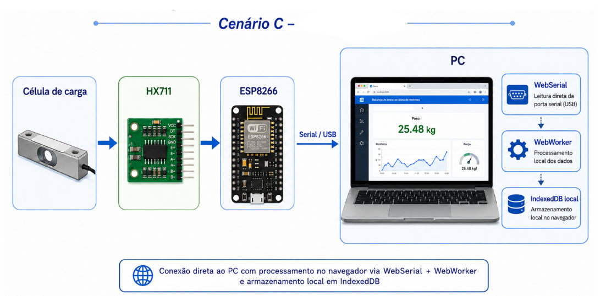
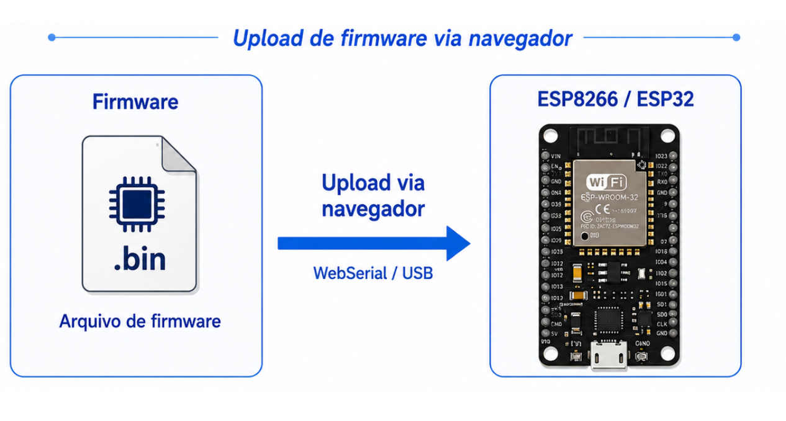
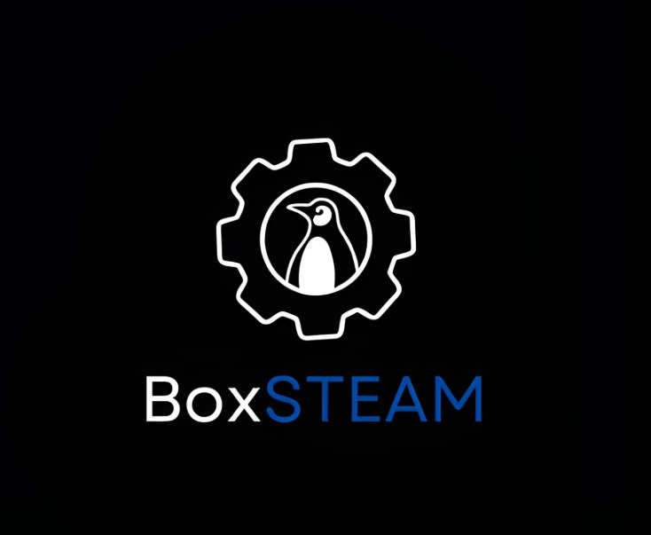

<div align="center">
  
  

  <h1>BalançaGFIG</h1>
  <p><strong>Sistema de Teste Estático de Motores Foguete</strong></p>
  <p>Instituto Federal de Santa Catarina — Campus Gaspar</p>

  
  
  
  
  
</div>

---

## O que é

O **BalançaGFIG** é um sistema open-source de bancada para testes estáticos de motores de minifoguete experimentais. Ele captura a curva de empuxo em tempo real por meio de uma célula de carga (HX711 + ESP8266), processa os dados no browser e gera relatórios completos com classificação NAR, métricas avançadas e exportação em múltiplos formatos.

**Funcionalidades principais:**
- Leitura de força em tempo real a ~100 Hz via WebSocket ou WebSerial
- Gráficos dinâmicos com detecção automática de início/fim de queima
- Análise pós-teste: força pico, RMS, impulso total, Isp, perfil, coeficiente de variação
- Classificação automática NAR (A–O) com nome padronizado (ex.: "B1.7")
- Exportação em PDF, CSV, JSON e `.eng` (OpenRocket)
- Comparação visual de múltiplas sessões
- Gravação de firmware no ESP diretamente pelo browser

---

## Hardware necessário

| Componente | Observação |
|---|---|
| ESP8266 (NodeMCU v2 / Wemos D1 Mini) | Microcontrolador principal |
| Módulo HX711 | Amplificador para célula de carga |
| Célula de carga | Capacidade adequada ao motor testado |
| Cabo USB | Para alimentação e gravação |
| TVBox com Linux (opcional) | Para o Cenário A (gateway fixo) |

### Esquema Elétrico

<div align="center">
  
</div>

---

## Cenários de uso

O sistema suporta dois cenários de operação, dependendo do hardware disponível:

### Cenário A — TVBox / Gateway

O ESP8266 fica conectado permanentemente a um TVBox (ou Raspberry Pi) que roda os serviços Docker. Qualquer dispositivo na rede (celular, tablet, notebook) acessa a interface pelo browser.

<div align="center">
  
</div>

### Cenário C — PC com WebSerial

O ESP8266 é conectado diretamente ao computador via USB. O browser usa a **WebSerial API** (Chrome/Edge) para ler a porta serial sem instalar nenhum software. As sessões ficam salvas no IndexedDB do browser.

<div align="center">
  
</div>

---

## Arquitetura

O projeto é um **monorepo npm workspace** com 7 pacotes TypeScript organizados em camadas:

```
ESP8266 + HX711
       │ USB 921600 baud (protocolo binário + CRC16)
       ▼
┌──────────────────────────────────────────┐
│  gateway  (Node.js)                      │
│  Lê porta serial → aplica pipeline →     │
│  publica via WebSocket :8765             │
└──────────────┬───────────────────────────┘
               │ WebSocket / WebSerial
               ▼
┌──────────────────────────────────────────┐
│  aplicacao  (Vite + TypeScript)          │
│  Interface web — medição, sessões,       │
│  análise, relatórios, configurações      │
└──────────────┬───────────────────────────┘
               │ REST HTTP :3000
               ▼
┌──────────────────────────────────────────┐
│  api  (Fastify + SQLite)                 │
│  Persiste sessões, leituras e metadados  │
└──────────────────────────────────────────┘
```

### Pacotes

| Pacote | Responsabilidade |
|---|---|
| `protocolo` | Codec binário + CRC16 para o protocolo ESP↔Host |
| `processamento` | Pipeline tempo real: zona morta, média móvel, detector de queima, integrador de impulso |
| `analise` | Métricas pós-teste: pico, RMS, perfil, classificação NAR, anomalias, Isp |
| `relatorio` | Geração de PDF, CSV, JSON e `.eng` (OpenRocket) |
| `gateway` | Bridge serial → WebSocket (Node.js + serialport) |
| `api` | API REST com Fastify + SQLite/MariaDB |
| `aplicacao` | Frontend Vite + ApexCharts |

---

## Pré-requisitos

- [Node.js](https://nodejs.org) ≥ 20
- [Docker + Docker Compose](https://docs.docker.com/get-docker/) (apenas para Cenário A)
- [PlatformIO](https://platformio.org) (apenas para compilar o firmware)
- Chrome ou Edge (para WebSerial no Cenário C)

---

## Início rápido

### 1. Clonar o repositório

```bash
git clone https://github.com/gfig-ifsc/balancaGFIG2.git
cd balancaGFIG2
npm install
```

### 2. Cenário A — Subir com Docker

```bash
# Conectar o ESP8266 na porta USB do TVBox antes de subir
docker compose -f docker/docker-compose.yml up -d
```

Acesse **`http://<IP-do-TVBox>`** em qualquer navegador da rede.

Para usar MariaDB em vez de SQLite:

```bash
docker compose -f docker/docker-compose.yml \
               -f docker/docker-compose.mariadb.yml up -d
```

### 3. Cenário C — Desenvolvimento local

```bash
cd pacotes/aplicacao
npm run dev        # Inicia em http://localhost:5173
```

Abra no Chrome ou Edge, selecione **"WebSerial"** na tela de conexão e conecte o ESP8266 pelo USB.

---

## Gravar o firmware no ESP8266

O firmware já compilado está em `firmware/firmware.bin`. Há duas formas de gravá-lo:

### Via browser (sem instalar nada)

1. Acesse a aplicação → menu **Firmware**
2. Clique em **"Gravar via Browser"** (requer Chrome/Edge com o ESP conectado via USB)

<div align="center">
  
</div>

### Via linha de comando (esptool)

```bash
# Na primeira gravação, apague a flash para inicializar a EEPROM corretamente
esptool.py --port /dev/ttyUSB0 erase_flash

# Gravar firmware
esptool.py --port /dev/ttyUSB0 --baud 921600 write_flash 0x0 firmware/firmware.bin
```

### Compilar o firmware (opcional)

```bash
cd firmware
pio run --target upload   # compila e grava
pio run --target upload --upload-port /dev/ttyUSB0
```

---

## Calibração

Após gravar o firmware, acesse **Configurações** na interface web para ajustar os parâmetros da célula de carga. O assistente de calibração guiado está disponível na tela de Medição (botão **Calibração**):

1. **Tara** — sem carga, zereia a leitura
2. **Massa conhecida** — informe o peso em gramas para calcular o fator de conversão
3. Os valores são salvos na EEPROM do ESP e persistem após reinicialização

---

## Desenvolvimento

### Compilar todos os pacotes

```bash
npm run compilar
```

### Rodar os testes

```bash
npm test                        # todos os pacotes
npm run testar:cobertura        # com relatório de cobertura
```

### Estrutura de pastas

```
balancaGFIG2/
├── firmware/                   # Firmware ESP8266 (C++ / PlatformIO)
│   ├── src/main.cpp            # Protocolo binário, leitura HX711, EEPROM
│   ├── platformio.ini
│   └── versao.json             # Versão atual (V16, protocolo v2)
│
├── pacotes/
│   ├── protocolo/              # Codec binário + CRC16
│   ├── processamento/          # Pipeline de aquisição em tempo real
│   ├── analise/                # Análise pós-teste e classificação NAR
│   ├── relatorio/              # Geração de documentos e exportações
│   ├── gateway/                # Bridge serial → WebSocket
│   ├── api/                    # API REST (Fastify + SQLite)
│   └── aplicacao/              # Interface web (Vite + TypeScript)
│
├── docker/
│   ├── docker-compose.yml
│   ├── docker-compose.mariadb.yml
│   ├── Dockerfile.gateway
│   ├── Dockerfile.api
│   ├── Dockerfile.webapp
│   └── nginx.conf
│
├── ponta-a-ponta/              # Testes E2E (Playwright)
└── package.json                # Workspace raiz
```

---

## Protocolo serial

O ESP8266 envia pacotes binários de 20 bytes a 921600 baud:

| Campo | Tipo | Descrição |
|---|---|---|
| `magic` | uint16 | `0xA1B2` — identificador de pacote |
| `versão` | uint8 | `0x02` |
| `tipo` | uint8 | `0x01` = dados, `0x02` = config, `0x03` = status |
| `t_ms` | uint32 | `millis()` do ESP |
| `forca_N` | float32 | Força em Newtons |
| `raw_value` | int32 | Valor ADC bruto do HX711 |
| `status` | uint8 | 0=pesando, 1=tarar, 2=calibrar, 3=pronta |
| `crc` | uint16 | CRC16-CCITT sobre os campos anteriores |

---

## Demo online

A interface web está disponível em modo de demonstração (sem hardware) no GitHub Pages:

**[rbeninca.github.io/balancaGFIG2](https://rbeninca.github.io/balancaGFIG2)**

> No modo demo, use **"Sessões"** para carregar sessões salvas e explorar a análise, relatórios e comparações sem precisar do hardware.

---

## Créditos

<div align="center">
  
  &nbsp;&nbsp;
  
  &nbsp;&nbsp;
  
  &nbsp;&nbsp;
  
</div>

<br>

Desenvolvido pelo **Grupo de Foguetes do Campus Gaspar (GFIG)** com apoio do grupo de pesquisa **CompSteam** e do projeto de ensino **BoxSteam**, no **Instituto Federal de Santa Catarina — Campus Gaspar**.

© 2025 IFSC Campus Gaspar — Licença MIT
